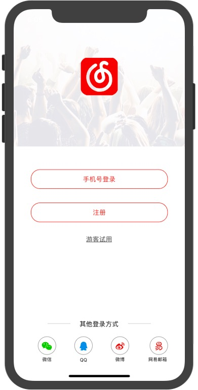
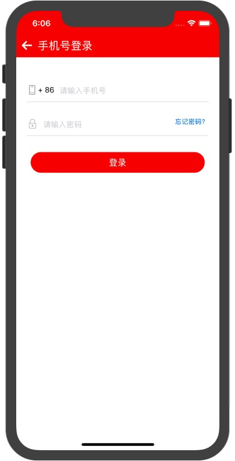
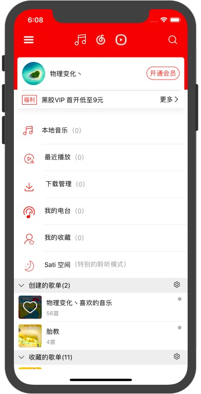
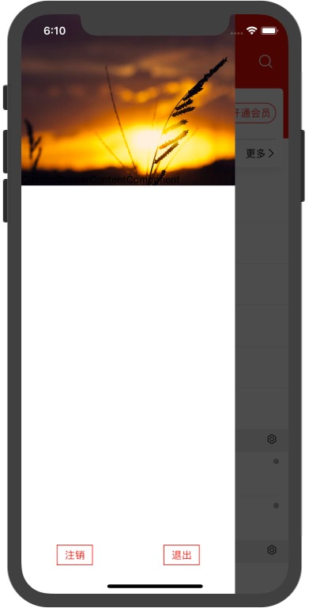

# NeteaseCloudMusic

使用 react-native 模仿网易云音乐，API 使用<a href="https://github.com/Binaryify/NeteaseCloudMusicApi">https://github.com/Binaryify/NeteaseCloudMusicApi</a>

```sh

$ git clone https://github.com/Jackyzm/RN-NeteaseCloudMusic.git

$ cd RN-NeteaseCloudMusic

$ yarn install

$ react-native link

$ yarn start

$ yarn ios / yarn android

```

## 效果如下

### 1、登录页





### 2、首页



### 3、Drawer



### 更多正在不停的开发中。。。
